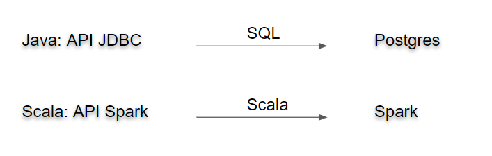

# SPARK != Scala


Scala es un lenguaje de programación como Java, C, SQL.

Spark es un "motor" mas comparable a una BD relacional como postgres.


**¿Porque la confusión frecuente entre Spark y Scala cuando no hay tanto confusión entre postgres y SQL?**

- postgres esta escrito en lenguaje C, pero su motor ejecuta código SQL

  => Spark esta escrito en Scala y ejecuta código Scala dentro de su motor,

- SQL es soportado por varios otros motores de BD relacional,

  => el uso mas popular de Scala es Spark

- el código cliente de postgres puede ser en varios lenguajes: Java, PHP, C, etc.

  => el código "cliente" de Spark es en Scala

- La API JDBC, no se parece para nada a las otras API's de Java

  => la API cliente Spark se parece muchísimo a la API de Collections de Scala

  



```Scala
 case class Movimiento (fecha: String, valor: Int)

 case class Cartola (num_cuenta: Int, saldo_inicial: Int, movimientos: Array [Movimiento])


 /**

  \* Filtra las cartolas que tuvieron por lo menos 3 movimientos superior a 50% del saldo inicial

  *

  \* @param cartolas 

  */

 def getCuentasMovimientosImportantes (cartolas: Dataset [Cartola]) (implicit sqlContext: SQLContext): Dataset [Int] = {

  import sqlContext.implicits._


  cartolas

   .filter (cartola => {                // este filter es parte de la API de Spark

​    val threshold = cartola.saldo_inicial / 2


​    val movimientos_grande = cartola.movimientos

​     .map (_.valor)                 // esta map es parte de la API estándar de Scala 

​     .filter (_ > threshold)             // este filter es parte de la API estándar de Scala 


​    movimientos_grande.size >= 3

   })

   .map (_.num_cuenta)                 // este map es parte de la API de Spark

 }
```

